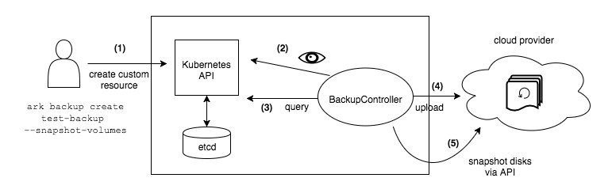

# velero
Backup and Restore of Kubernetes Applications using Heptio’s Velero with Restic and S3 (minio) as the storage provider


**Backup and Disaster Recovery**

**Overview**

Velero (formerly Heptio Ark) gives you tools to back up and restore your Kubernetes cluster resources and persistent volumes. Velero lets you:

* Take backups of your cluster and restore in case of loss.
* Migrate cluster resources to other clusters.
* Replicate your production cluster to development and testing clusters.

**Installation:**

*Note: Please use an official release of Velero*

```markdown

$ cd $HOME/velero-rook-tutorial
$ wget https://<link-copied-from-releases-page>
$ tar -xvzf velero-v0.11.0-$release-amd64.tar.gz 
$ sudo mv velero /usr/local/bin/ 
$ velero help

```

**Installing Velero Server**

*Installing pre-requisites*

```markdown

$ kubectl apply -f config/common/00-prereqs.yaml

```

What does the pre-requisites install on our cluster ?

* A velero Namespace
* The velero Service Account
* Role-based access control (RBAC) rules to grant permissions to the velero Service Account
* Custom Resources (CRDs) for the velero-specific resources.

*Velero needs a S3 compatible object storage to store the backups.*

We Are using minio as Example.

**Whats is minio**

A high performance, distributed object storage server, designed for large-scale data infrastructure. It is an ideal S3-compatible replacement for Hadoop HDFS and scale out NAS for machine learning and other big data workloads


**Support Matrix**

* IBM Cloud
* Minio
* Ceph RADOS v12.2.7
* DigitalOcean
* Quobyte
* NooBaa
* Oracle Cloud

-----More About support Matrix------

Below steps are for deploying Velero using minio as example for the object store for backups. Should you wish to use any other cloud provider object storage. Follow the guidelines mentioned in the support-matrix.

The below commands will setup a local minio server as well as ark pods.
Please note the ACCESS KEY for **minio** is minio and SECREY KEY is **minio123**

*Setup*

```markdown
$ kubectl apply -f https://raw.githubusercontent.com/mboumsahi/velero/master/minio-deployment.yaml
$ kubectl apply -f https://raw.githubusercontent.com/mboumsahi/velero/master/minio-storage-location.yaml
$ kubectl apply -f https://raw.githubusercontent.com/mboumsahi/velero/master/minio-pvc.yaml
$ kubectl apply -f https://raw.githubusercontent.com/mboumsahi/velero/master/minio-service.yaml

```

*Install Restic*

```markdown

apt-get install restic

```

*Configure Restic*

```markdown

velero install --provider minio-service --bucket resticbucket  --secret-file=./credentials-velero --use-restic

```

*Expose minio*

```markdown

minikube service minio-service

```


**How Does Velero Work ?**

When you run velero backup create test-backup:

* The Velero client makes a call to the Kubernetes API server to create a Backup object.
* The BackupController notices the new Backupobject and performs validation.
* The BackupController begins the backup process. It collects the data to back up by querying the API server for resources.
* The BackupController makes a call to the object storage service – for example, AWS S3 – to upload the backup file.




**Backup**

There are a couple of ways to take backup using velero.

1. Take backup of the entire namespace

```markdown

$ velero backup create <bkp-name> --include-namespaces <namespace-name>

```

2. Annotate the pods you’d like to take the backup of and only those volume names specified will be taken for backup. The form of the command is below

```markdown

$ kubectl -n YOUR_POD_NAMESPACE annotate pod/YOUR_POD_NAME backup.velero.io/backup-volumes=YOUR_VOLUME_NAME_1,YOUR_VOLUME_NAME_2,...

```

Let’s annotate our pods for a clearer understanding:

```markdown

$ kubectl -n wordpress annotate pod/<WORDPRESS_POD_NAME> backup.velero.io/backup-volumes=wordpress-persistent-storage
$ kubectl -n wordpress annotate pod/<MYSQL_POD_NAME> backup.velero.io/backup-volumes=mysql-persistent-storage

```

**Scheduled Backups**

Taking a backup manually happens only in an emergency situation or for educational purposes. The real essence of a backup and disaster recovery plan is to have scheduled backups. Ark provides that support in a rather simple manner.

```markdown

$ velero schedule create daily-wordpress-backup--schedule="0 10 * * *" --include-namespaces wordpress
Schedule "daily-wordpress-backup" created successfully.

```


